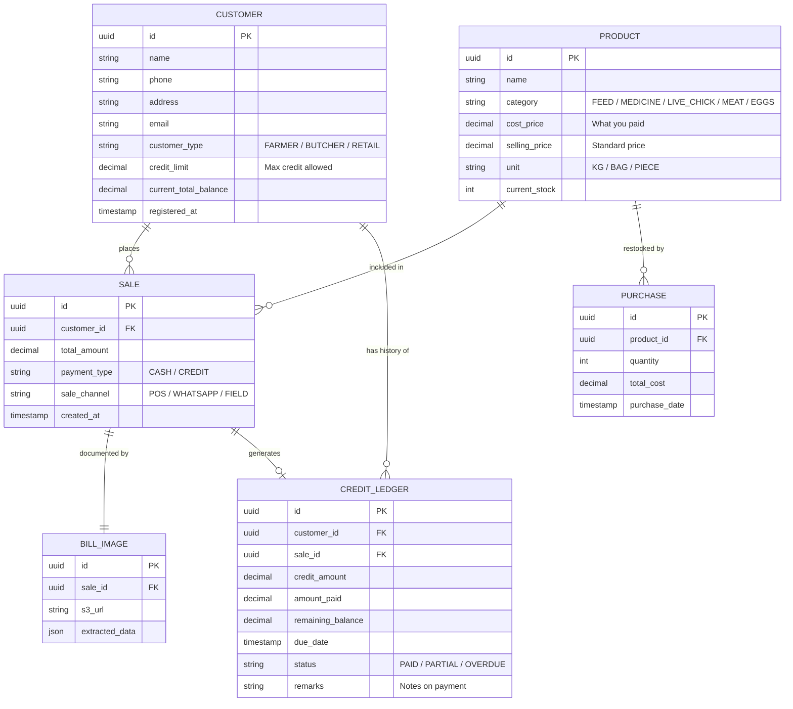
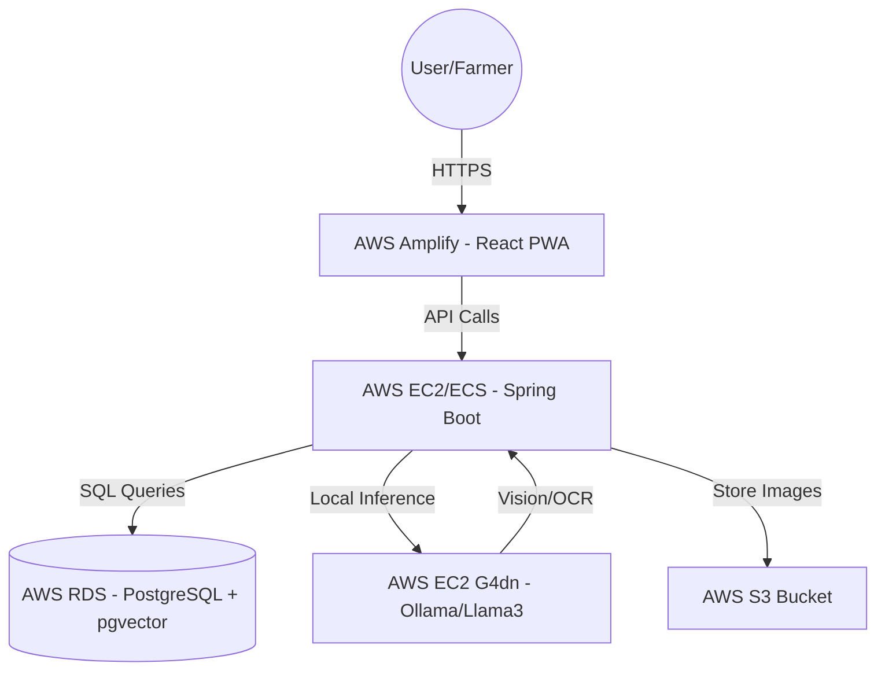

# 📖 FarmSmart AI: Project Wiki

## 1. Project Overview
**FarmSmart AI** is an intelligent ERP and Billing solution designed for poultry farm management. It handles complex sales cycles (cash/credit), inventory tracking, and financial health monitoring using local-first AI to ensure data privacy and offline resilience.

### Key Capabilities
*   **Vision-to-Bill:** Snap a photo of a sales slip; AI extracts items, quantities, and totals.
*   **Smart Business Ask (RAG):** Natural language queries for business insights (e.g., "Predict sales based on last month").
*   **Credit Management:** Automated ledger for customer debts and payment history.
*   **Self-Hosted AI:** No paid APIs; Llama 3/Mistral hosted on private AWS infrastructure.

---

## 2. Technical Stack
*   **Frontend:** React.js (PWA) with Tailwind CSS.
*   **Backend:** Java 21 with Spring Boot 3.x.
*   **AI Integration:** LangChain4j + Ollama (running Llama 3.2 Vision & Llama 3 8B).
*   **Database:** PostgreSQL with **pgvector** extension.
*   **Infrastructure:** AWS (Amplify for UI, EC2 G4dn for LLM, RDS for Data).

---

## 3. Entity Relationship Diagram (ERD)
This diagram defines how your farm data is structured.

---

## 4. Infrastructure Diagram
Describes how the app is hosted on AWS.

---

## 5. Execution Roadmap
1.  **Phase 1 (Core):** Setup Spring Boot + PostgreSQL. Build basic CRUD for Products and Customers.
2.  **Phase 2 (Finance):** Implement Sale/Purchase logic and Profit/Loss calculation scripts.
3.  **Phase 3 (AI Vision):** Setup Ollama with `llama3.2-vision`. Build the Java service to process images into JSON.
4.  **Phase 4 (RAG):** Implement `pgvector` and LangChain4j to allow "Smart Business Ask" features.
5.  **Phase 5 (Cloud):** Deploy to AWS and configure the PWA for offline mobile use.

---

## 6. Future AI Context Summary

> "I am building **FarmSmart AI**, a poultry farm ERP. 
> **Architecture:** Java (Spring Boot), React, PostgreSQL (pgvector), hosted on AWS with a self-hosted Ollama (Llama 3).
> **Data Model:** 
> - **Customers** are categorized as **Farmers** (buying chicks/feed/medicine), **Butchers** (buying meat/eggs), or **Retail** (cash only). 
> - **Inventory** tracks different categories (Feed, Medicine, Live Stock, Meat).
> - **Credit Ledger** tracks debt history and partial payments, linked to customers and specific sales.
> **AI Features:** 
> 1. **Vision:** Extracting sales data from photos of bills. 
> 2. **RAG:** Answering business questions about profit, expected sales, and customer credit status.
> I have the ERD (v3) ready. Please help me with implementation steps."