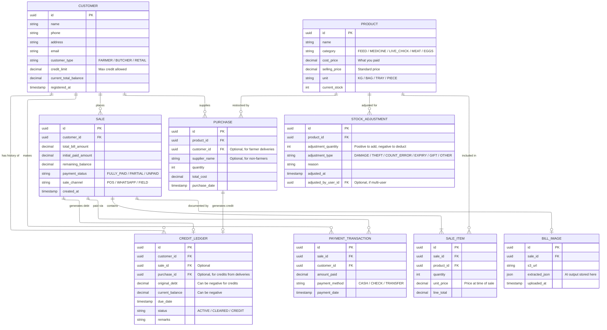

# 📖 FarmSmart AI: Project Wiki

## 1. Project Overview
**FarmSmart AI** is an intelligent ERP and Billing solution designed for poultry farm management. It handles complex sales cycles (cash/credit), inventory tracking, and financial health monitoring using local-first AI to ensure data privacy and offline resilience.

### Key Capabilities
*   **Vision-to-Bill:** Snap a photo of a sales slip; AI extracts items, quantities, and totals.
*   **Smart Business Ask (RAG):** Natural language queries for business insights (e.g., "Predict sales based on last month").
*   **Credit Management:** Automated ledger for customer debts and payment history.
*   **Self-Hosted AI:** No paid APIs; Llama 3/Mistral hosted on private AWS infrastructure.

---

## 2. Technical Stack
*   **Frontend:** React.js (PWA) with Tailwind CSS.
*   **Backend:** Java 21 with Spring Boot 3.x.
*   **AI Integration:** LangChain4j + Ollama (running Llama 3.2 Vision & Llama 3 8B).
*   **Database:** PostgreSQL with **pgvector** extension.
*   **Infrastructure:** AWS (Amplify for UI, EC2 G4dn for LLM, RDS for Data).

---

## 3. Entity Relationship Diagram (ERD)
This diagram defines how your farm data is structured.

---

## 4. Infrastructure Diagram
Describes how the app is hosted on AWS.

---

## 5. AI Architecture (Intent-Driven)

FarmSmart AI uses a **hallucination-proof, intent-driven architecture** that eliminates SQL generation by the LLM, ensuring ERP safety and data integrity.

### Architecture Flow

### Key Principles

| Component | Role | SQL Access |
|-----------|------|------------|
| **IntentClassifier** | LLM classifies user intent to JSON | ❌ None |
| **QueryIntent** (enum) | 20+ predefined intents | ❌ None |
| **SqlTemplateRegistry** | Hardcoded SQL templates | ✅ SELECT only |
| **QueryPlanner** | Deterministic query execution | ✅ Executes templates |
| **DatabaseTool** | Accepts natural language descriptions | ❌ No SQL input |

### Supported Intents

#### Inventory (4 intents)
- `INVENTORY_CHECK_PRODUCT` - Check stock for a specific product
- `INVENTORY_LOW_STOCK` - Find products below threshold
- `INVENTORY_BY_CATEGORY` - List products by category
- `INVENTORY_ALL` - List all products

#### Sales (5 intents)
- `SALES_TOTAL_BY_CUSTOMER` - Customer sales summary
- `SALES_TOTAL_BY_DATE_RANGE` - Sales within date range
- `SALES_BY_PRODUCT` - Product sales history
- `SALES_RECENT` - Recent transactions
- `SALES_DETAIL` - Detailed sale information

#### Credit (3 intents)
- `CREDIT_BALANCE_CUSTOMER` - Customer credit balance
- `CREDIT_OVERDUE_ALL` - Overdue accounts
- `CREDIT_SUMMARY` - Overall credit summary

#### Payments (3 intents)
- `PAYMENT_HISTORY_SALE` - Payment history for sale
- `PAYMENT_SUMMARY_BY_METHOD` - Payment totals by method
- `PAYMENT_HISTORY_CUSTOMER` - Customer payment history

#### Customers (3 intents)
- `CUSTOMER_INFO` - Customer details
- `CUSTOMER_LIST_BY_TYPE` - Customers by type
- `CUSTOMER_LIST_ALL` - All customers

#### Special (2 intents)
- `KNOWLEDGE_SEARCH` - Search poultry manuals (RAG)
- `CLARIFICATION_NEEDED` - Query unclear

### Safety Guarantees

✅ **No SQL Hallucination** - LLM outputs JSON only, never SQL  
✅ **Deterministic Queries** - Same intent always executes same SQL template  
✅ **ERP-Safe** - All queries are read-only (SELECT)  
✅ **Auditable** - Full console logging of all queries  
✅ **Type-Safe** - Named parameters prevent SQL injection  

### Example Conversation

**User:** "How many Flu Vaccine do we have?"

**Backend Flow:**
1. IntentClassifier → `{"intent": "INVENTORY_CHECK_PRODUCT", "entities": {"productName": "Flu Vaccine"}}`
2. QueryPlanner → Executes template: `SELECT name, current_stock, unit FROM product WHERE LOWER(name) = LOWER(:productName)`
3. Database → Returns: `[{name: "Flu Vaccine", current_stock: 38, unit: "PIECE"}]`
4. LLM → "We currently have 38 pieces of Flu Vaccine in stock."

**No SQL appears in the conversation.**

---

## 6. Execution Roadmap
1.  **Phase 1 (Core):** Setup Spring Boot + PostgreSQL. Build basic CRUD for Products and Customers.
2.  **Phase 2 (Finance):** Implement Sale/Purchase logic and Profit/Loss calculation scripts.
3.  **Phase 3 (AI Vision):** Setup Ollama with `llama3.2-vision`. Build the Java service to process images into JSON.
4.  **Phase 4 (RAG):** Implement `pgvector` and LangChain4j to allow "Smart Business Ask" features.
5.  **Phase 5 (Cloud):** Deploy to AWS and configure the PWA for offline mobile use.

---

## 7. Future AI Context Summary
**Copy and paste this paragraph the next time you start a chat with an AI to resume work:**

> "I am building **FarmSmart AI**, a poultry farm billing and ERP app. **Tech Stack:** Java (Spring Boot), React, and PostgreSQL with pgvector. **Hosting:** AWS (Amplify, RDS, EC2 with GPU). **Key Features:** Credit/Cash sales management, inventory tracking, and profit analysis. It uses a **self-hosted LLM (Ollama/Llama 3)** for two main AI features: 
> 1. **RAG/Text-to-SQL** for 'Smart Business Ask' (e.g., forecasting sales, querying credit totals). 
> 2. **Multimodal Vision** for extracting sales details from photos of physical bills. 
> I have the ERD and Infrastructure plan ready. Please help me with the next step of the implementation."
