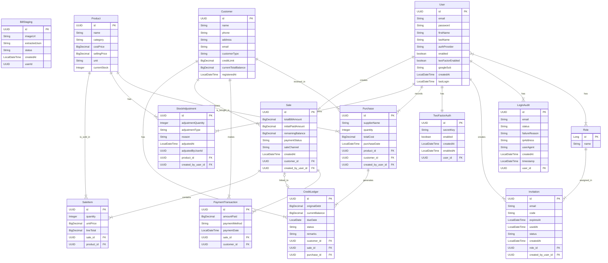

# 📖 FarmSmart AI: Project Wiki

## 1. Project Overview
**FarmSmart AI** is an intelligent ERP and Billing solution designed for poultry farm management. It handles complex sales cycles (cash/credit), inventory tracking, and financial health monitoring using local-first AI to ensure data privacy and offline resilience.

### Key Capabilities
*   **Vision-to-Bill:** Snap a photo of a sales slip; AI extracts items, quantities, and totals.
*   **Smart Business Ask (RAG):** Natural language queries for business insights (e.g., "Predict sales based on last month").
*   **Credit Management:** Automated ledger for customer debts and payment history.
*   **Cloud AI:** Google Gemini API for vision-based bill extraction and intelligent business insights.

---

## 2. Technical Stack
*   **Frontend:** React.js (PWA) with Tailwind CSS.
*   **Backend:** Java 21 with Spring Boot 3.x.
*   **AI Integration:** LangChain4j + Google Gemini API (Gemini 1.5 Flash for chat, vision, and embeddings).
*   **Database:** Google Cloud AlloyDB for PostgreSQL with **pgvector** extension.
*   **Infrastructure:** GCP (Firebase Hosting for PWA, Cloud Run for backend, AlloyDB for data).

---

## 3. Entity Relationship Diagram (ERD)
This diagram defines how your farm data is structured.



---

## 4. Infrastructure Diagram
Describes how the app is hosted on Google Cloud Platform.


---

## 5. AI Architecture (Intent-Driven)

FarmSmart AI uses a **hallucination-proof, intent-driven architecture** that eliminates SQL generation by the LLM, ensuring ERP safety and data integrity.

### Architecture Flow


### Key Principles

| Component | Role | SQL Access |
|-----------|------|------------|
| **IntentClassifier** | LLM classifies user intent to JSON | ❌ None |
| **QueryIntent** (enum) | 20+ predefined intents | ❌ None |
| **SqlTemplateRegistry** | Hardcoded SQL templates | ✅ SELECT only |
| **QueryPlanner** | Deterministic query execution | ✅ Executes templates |
| **DatabaseTool** | Accepts natural language descriptions | ❌ No SQL input |

### Supported Intents

#### Inventory (4 intents)
- `INVENTORY_CHECK_PRODUCT` - Check stock for a specific product
- `INVENTORY_LOW_STOCK` - Find products below threshold
- `INVENTORY_BY_CATEGORY` - List products by category
- `INVENTORY_ALL` - List all products

#### Sales (5 intents)
- `SALES_TOTAL_BY_CUSTOMER` - Customer sales summary
- `SALES_TOTAL_BY_DATE_RANGE` - Sales within date range
- `SALES_BY_PRODUCT` - Product sales history
- `SALES_RECENT` - Recent transactions
- `SALES_DETAIL` - Detailed sale information

#### Credit (3 intents)
- `CREDIT_BALANCE_CUSTOMER` - Customer credit balance
- `CREDIT_OVERDUE_ALL` - Overdue accounts
- `CREDIT_SUMMARY` - Overall credit summary

#### Payments (3 intents)
- `PAYMENT_HISTORY_SALE` - Payment history for sale
- `PAYMENT_SUMMARY_BY_METHOD` - Payment totals by method
- `PAYMENT_HISTORY_CUSTOMER` - Customer payment history

#### Customers (3 intents)
- `CUSTOMER_INFO` - Customer details
- `CUSTOMER_LIST_BY_TYPE` - Customers by type
- `CUSTOMER_LIST_ALL` - All customers

#### Special (2 intents)
- `KNOWLEDGE_SEARCH` - Search poultry manuals (RAG)
- `CLARIFICATION_NEEDED` - Query unclear

### Safety Guarantees

✅ **No SQL Hallucination** - LLM outputs JSON only, never SQL  
✅ **Deterministic Queries** - Same intent always executes same SQL template  
✅ **ERP-Safe** - All queries are read-only (SELECT)  
✅ **Auditable** - Full console logging of all queries  
✅ **Type-Safe** - Named parameters prevent SQL injection  

### Example Conversation

**User:** "How many Flu Vaccine do we have?"

**Backend Flow:**
1. IntentClassifier → `{"intent": "INVENTORY_CHECK_PRODUCT", "entities": {"productName": "Flu Vaccine"}}`
2. QueryPlanner → Executes template: `SELECT name, current_stock, unit FROM product WHERE LOWER(name) = LOWER(:productName)`
3. Database → Returns: `[{name: "Flu Vaccine", current_stock: 38, unit: "PIECE"}]`
4. LLM → "We currently have 38 pieces of Flu Vaccine in stock."

**No SQL appears in the conversation.**

---

## 6. Execution Roadmap
1.  **Phase 1 (Core):** Setup Spring Boot + PostgreSQL. Build basic CRUD for Products and Customers.
2.  **Phase 2 (Finance):** Implement Sale/Purchase logic and Profit/Loss calculation scripts.
3.  **Phase 3 (AI Vision):** Integrate Gemini API with `gemini-1.5-flash`. Build the Java service to process images into JSON.
4.  **Phase 4 (RAG):** Implement `pgvector` and LangChain4j to allow "Smart Business Ask" features.
5.  **Phase 5 (Cloud):** Deploy to GCP (Cloud Run + Firebase) and configure the PWA for offline mobile use.

---

## CI/CD and Deployment Architecture

### Workflow Strategy
- **Continuous Integration:** Every Pull Request and push to `main` triggers the `build.yml` workflow, ensuring that both the Spring Boot backend and React frontend build correctly without tests failing.
- **Production Deployment:** Deployment is triggered **only** when a semantic version tag (e.g., `v1.0.2`) is pushed to the repository.
- **Manual Approval:** The "prod" environment is required for deployments. This can be configured in GitHub Repository Settings > Environments, where you can specify "Required Reviewers."

### Infrastructure Targets
- **Backend:** Deployed as a containerized service on **Google Cloud Run**.
- **Frontend:** Hosted on **Firebase Hosting** for global CDN delivery and PWA support.
- **Secrets:** Managed via GitHub Actions Secrets and injected into Cloud Run via Google Secret Manager.

### Tag-Based Deployment Flow

To deploy a new version to production:

1. **Ensure all changes are committed and pushed to `main`**
   ```bash
   git add .
   git commit -m "Release v1.0.0"
   git push origin main
   ```

2. **Create and push a version tag**
   ```bash
   git tag v1.0.0
   git push --tags
   ```

3. **Monitor GitHub Actions**
   - Navigate to the "Actions" tab in your GitHub repository
   - Both `deploy-backend.yml` and `deploy-frontend.yml` will trigger automatically
   - Approve deployment if "prod" environment requires manual review

4. **Verify deployment**
   - Backend: Check Cloud Run service URL in workflow logs
   - Frontend: Visit your Firebase Hosting URL

### Required GitHub Secrets

Configure these secrets in **Settings > Secrets and variables > Actions**:

| Secret Name | Description | Example/Format |
|-------------|-------------|----------------|
| `GCP_PROJECT_ID` | Google Cloud Project ID | `smartfarm-prod-123456` |
| `GCP_REGION` | GCP region for Cloud Run | `us-central1` |
| `GCP_SA_KEY` | Service account JSON key | `{"type": "service_account", ...}` |
| `CLOUD_RUN_SERVICE` | Cloud Run service name | `smartfarm-backend` |
| `FIREBASE_SERVICE_ACCOUNT` | Firebase service account JSON | `{"type": "service_account", ...}` |
| `FIREBASE_PROJECT_ID` | Firebase project ID | `smartfarm-ai` |
| `INSTANCE_CONNECTION_NAME` | Cloud SQL connection string | `project:region:instance` |

> **Note:** The `GEMINI_KEY` secret should be configured in **Google Secret Manager** (not GitHub Secrets) and referenced in the Cloud Run deployment.

### Rollback Strategy

#### Backend (Cloud Run)
1. Open [Google Cloud Console](https://console.cloud.google.com/)
2. Navigate to **Cloud Run > [Your Service]**
3. Click **"Revisions"** tab
4. Select the previous stable revision
5. Click **"Manage Traffic"** and route 100% traffic to the stable revision
6. Click **"Save"**

**Alternative (CLI):**
```bash
gcloud run services update-traffic CLOUD_RUN_SERVICE \
  --to-revisions=REVISION_NAME=100 \
  --region=GCP_REGION
```

#### Frontend (Firebase Hosting)
1. Open [Firebase Console](https://console.firebase.google.com/)
2. Navigate to **Hosting > [Your Site]**
3. Click **"Release history"**
4. Find the previous stable deployment
5. Click the three-dot menu and select **"Rollback"**

**Alternative (CLI):**
```bash
firebase hosting:rollback --site=YOUR_SITE_ID
```

### Deployment Best Practices

- **Semantic Versioning:** Use `vMAJOR.MINOR.PATCH` format (e.g., `v1.2.3`)
- **Pre-release Tags:** Use `-alpha`, `-beta`, `-rc` suffixes for testing (e.g., `v1.0.0-beta`)
- **Changelog:** Maintain a `CHANGELOG.md` file documenting changes in each release
- **Testing:** Always verify CI build passes before creating release tags
- **Monitoring:** Set up Cloud Run and Firebase alerts for error rates and performance


## 7. Future AI Context Summary
**Copy and paste this paragraph the next time you start a chat with an AI to resume work:**

> "I am building **FarmSmart AI**, a poultry farm billing and ERP app. **Tech Stack:** Java 21 (Spring Boot 3.x), React (Vite PWA), and AlloyDB (PostgreSQL with pgvector). **Hosting:** GCP (Cloud Run for backend, Firebase Hosting for frontend, AlloyDB for database). **Key Features:** Credit/Cash sales management, inventory tracking, and profit analysis. It uses **Google Gemini API** for two main AI features: 
> 1. **RAG/Intent-Based Query** for 'Smart Business Ask' (e.g., forecasting sales, querying credit totals) using hardcoded SQL templates for safety. 
> 2. **Multimodal Vision** for extracting sales details from photos of physical bills using Gemini 1.5 Flash. 
> The app has OAuth2 (Google) authentication, invitation-based user registration, and 2FA support. I have the ERD and Infrastructure plan ready. Please help me with the next step of the implementation."
