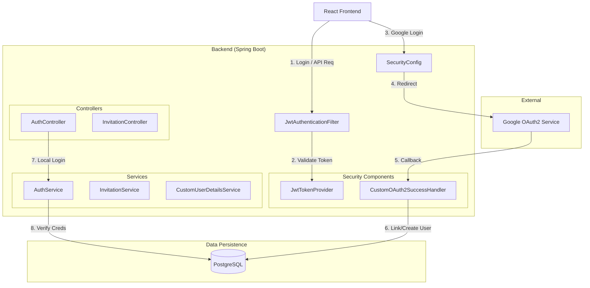
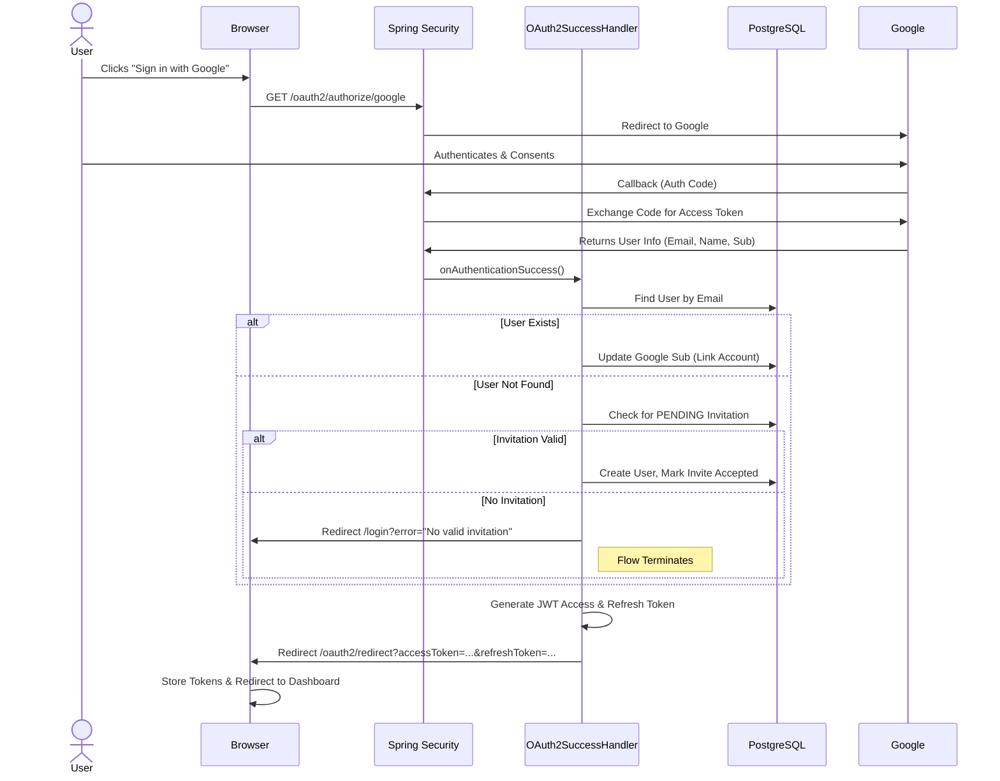
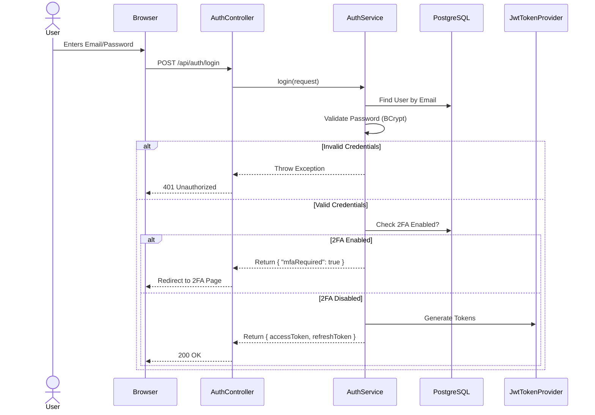
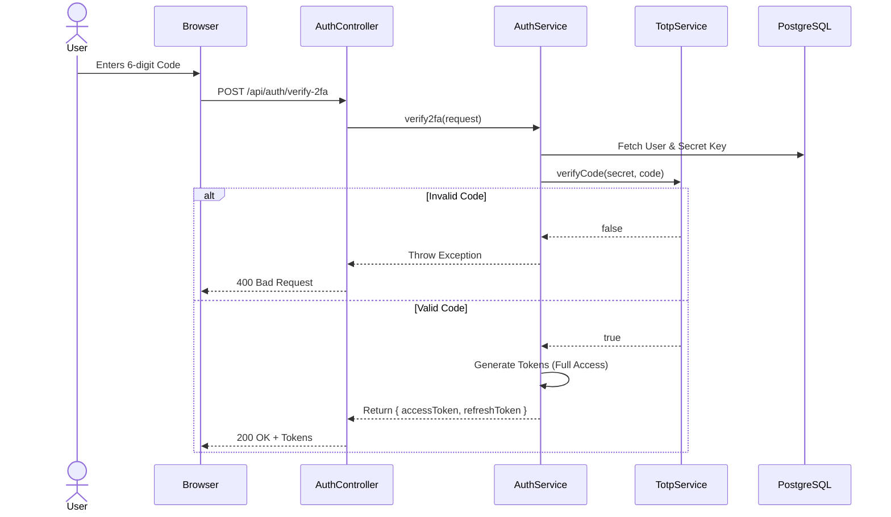
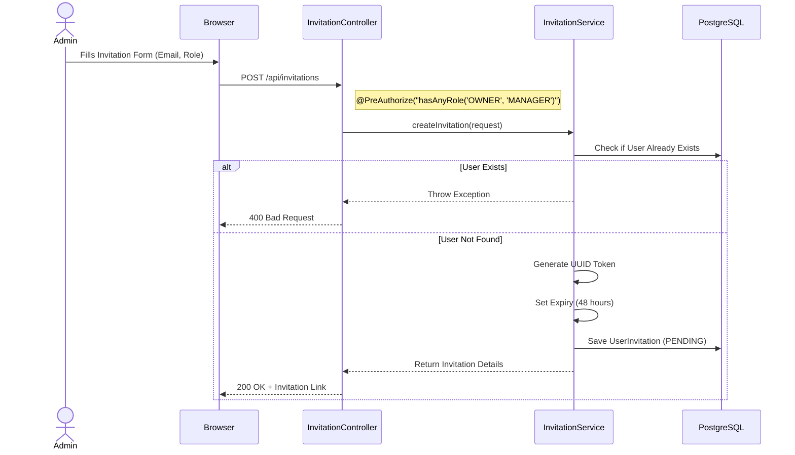
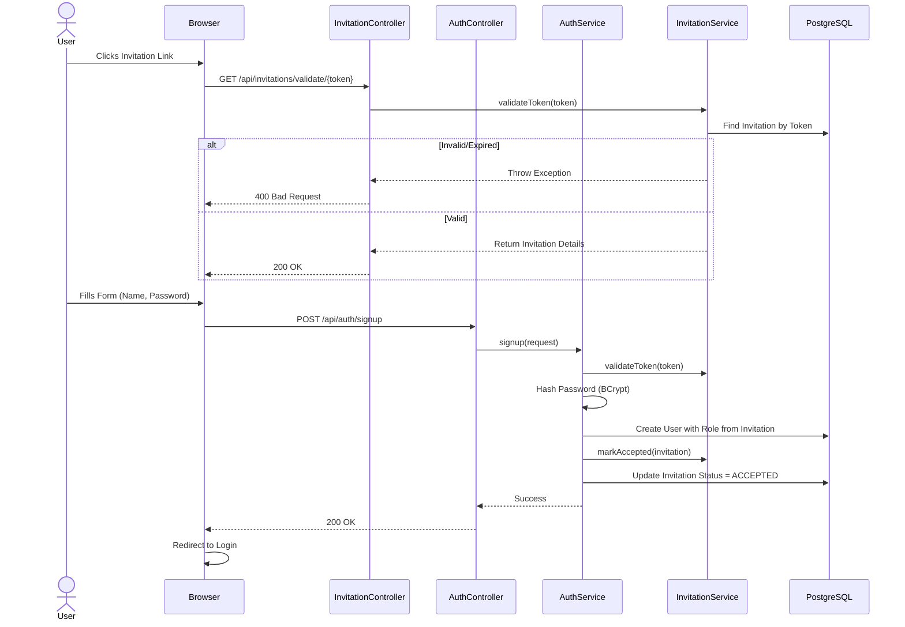
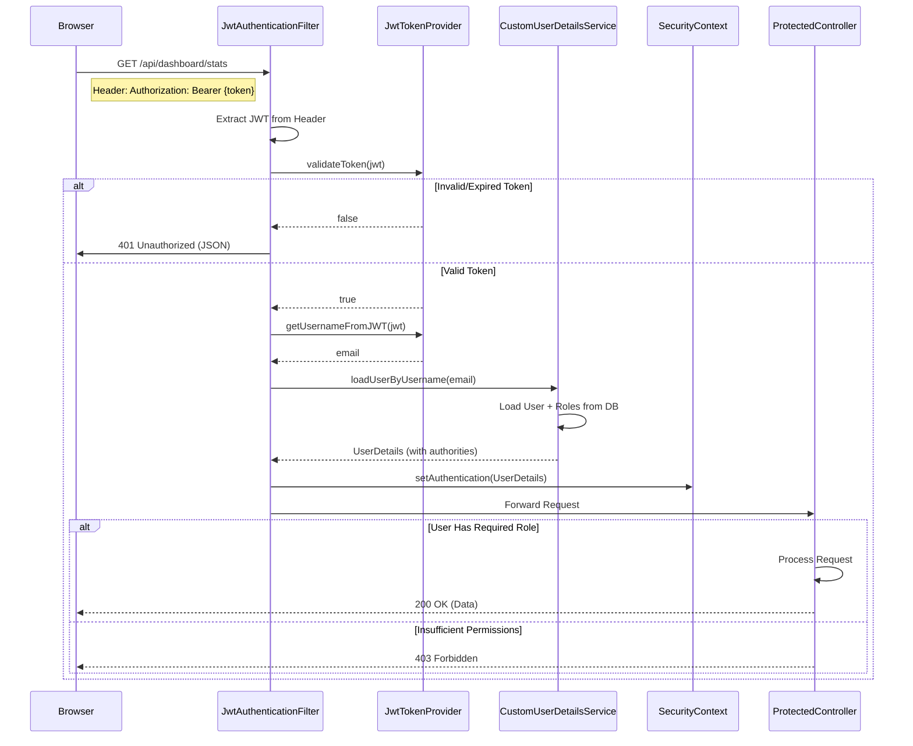
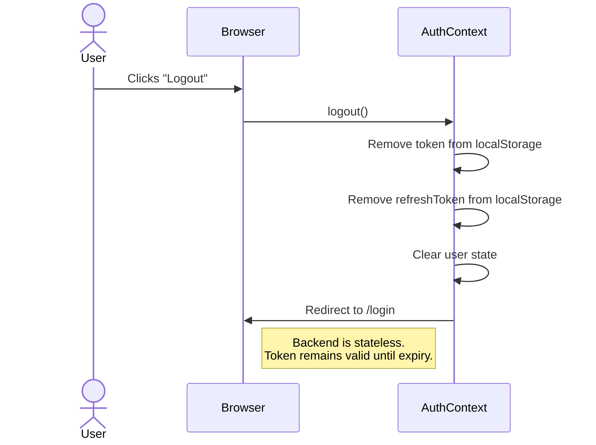
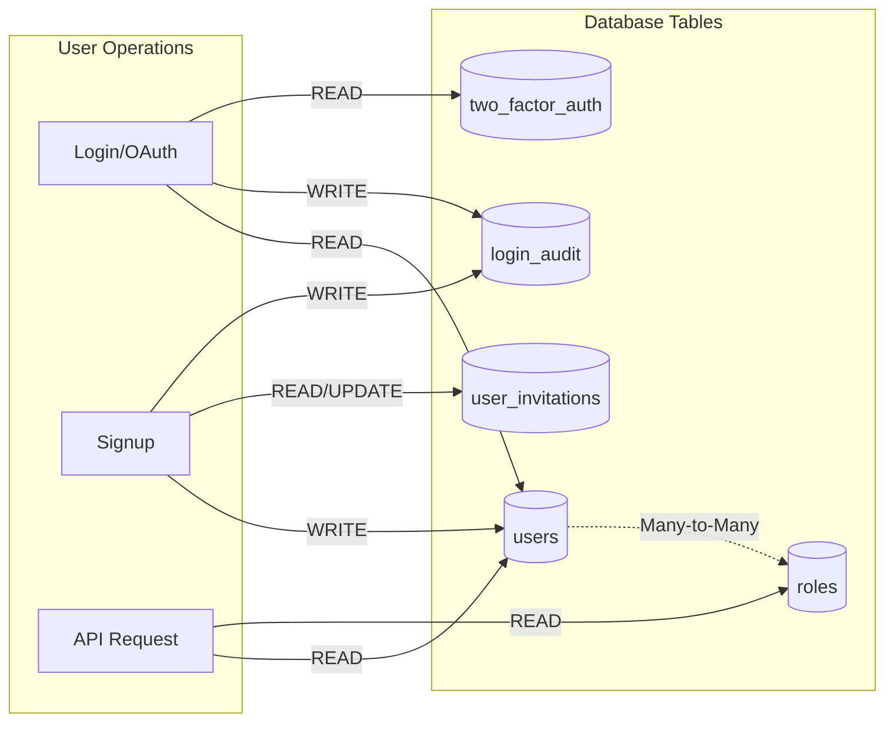
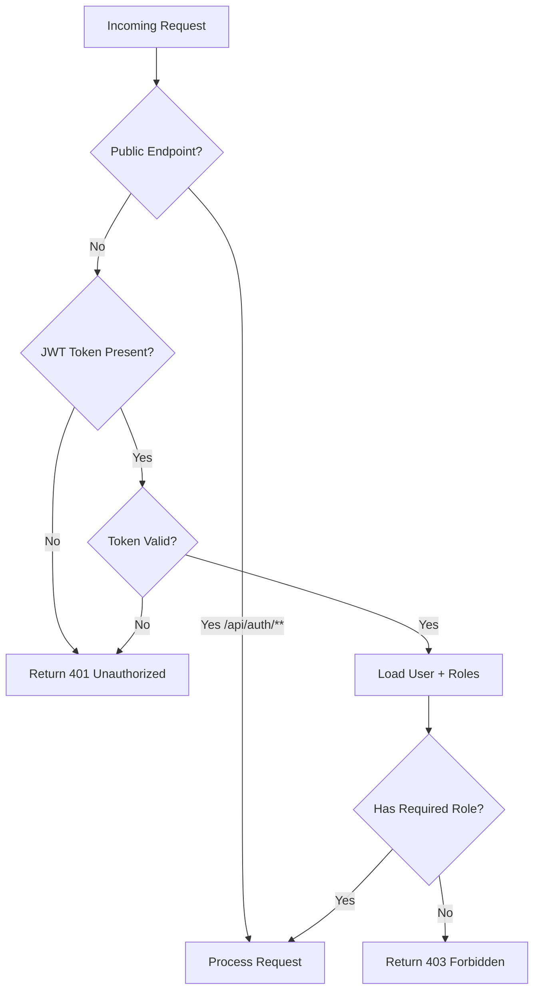

# FarmSmart AI - Authentication Flow Diagrams

## Component Architecture

## Flow 1: Google OAuth Login (Invitation Required)

## Flow 2: Email + Password Login

## Flow 3: Two-Factor Authentication (TOTP)

## Flow 4: Invitation Creation (Admin)

## Flow 5: Invitation Acceptance (Signup)

## Flow 6: Protected API Request (Authorization)

## Flow 7: Logout

## Data Flow: Database Interactions

## Security Decision Tree

